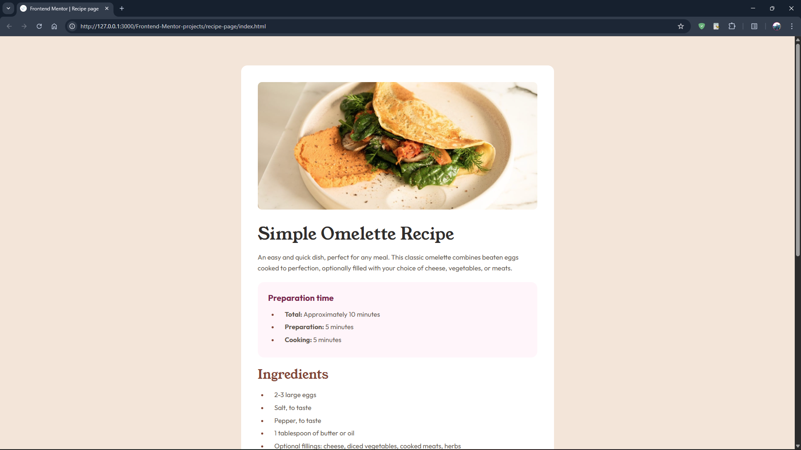
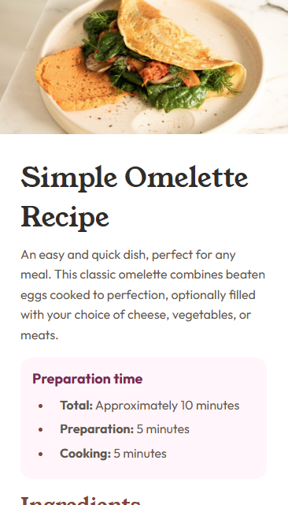

# Frontend Mentor - Recipe page solution

This is a solution to the [Recipe page challenge on Frontend Mentor](https://www.frontendmentor.io/challenges/recipe-page-KiTsR8QQKm). Frontend Mentor challenges help you improve your coding skills by building realistic projects.

## Table of contents

- [Overview](#overview)
  - [The challenge](#the-challenge)
  - [Screenshot](#screenshot)
  - [Links](#links)
- [My process](#my-process)
  - [Built with](#built-with)
  - [What I learned](#what-i-learned)
- [Author](#author)

## Overview

### The challenge


The challenge is to build out this **Recipe page** and get it looking as close to the design as possible.

### Screenshot

<details open>
<summary><strong> Desktop view </strong></summary>
<br>

</details>

<details open>
<summary><strong> Mobile view </strong></summary>
<br>

</details>

### Links

- Solution URL: [Solution]()
- Live Site URL: [Live site]()

## My process

### Built with

- Semantic HTML5 markup
- CSS custom properties
- Flexbox
- `@media` queries and `clamp()` property

### What I learned

> CSS

```css
/* hr styling */
hr {
  border: solid;
  border-width: 1px 0 0 0;
  opacity: 30%;
  margin: clamp(10px, 1.5vw, 15px) 20px;
}

/* li marker styling */
li::marker {
  color: var(--brown-800);
  font-weight: 600;
}
```

## Author

- Website - [Surjo Karmokar](https://surjo.pages.dev/)
- Frontend Mentor - [@Surjo981](https://www.frontendmentor.io/profile/surjo981/)

## Thank You 😊✨
